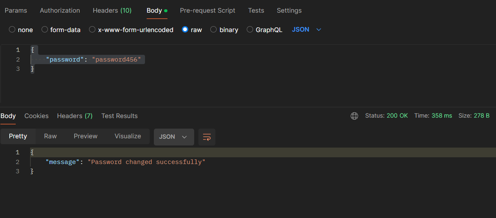

# W7D1 - In-Class Group Assignment - Secure Blog

This assignment was good for me. I got practice setting up a database with Atlas. I finished the rest of the logic in the post functions to complete the capabilty of creating a post, updating a post, deleting a post, and getting all of a users posts.

I then used MongoDB to interact with the cluster for the database. I tested all of the routes with Postman with valid data as well as invalid data. I separated the User routes logic from the controller logic. I also added the functionality for a user to change their profile info that they registered with. Below are some of the images of route testing.

Register a user

Login a user

Get users posts by ID

Delete a post

Update a post

Change password

Users in database

Posts in database

